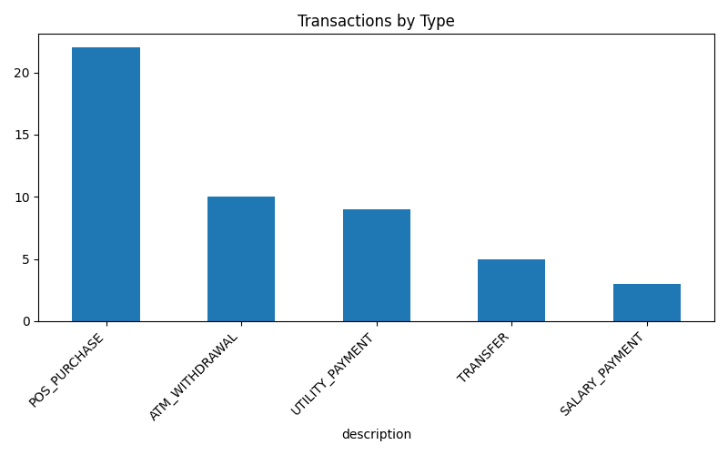
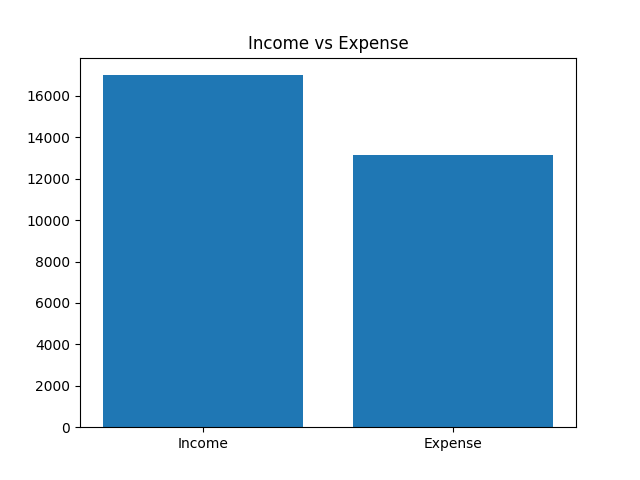

# Bank Transactions ETL Pipeline

This project simulates a real-world banking data pipeline using Python.

It generates synthetic financial transactions, applies data cleaning and validation rules, and loads the data into a relational database for analysis.

The objective is to replicate real Data Engineering challenges such as handling dirty data, managing data quality, and extracting business insights from transactional systems.

---

## Business Context

Inspired by real banking systems, this project models how financial transaction data is processed and analyzed.

It includes:

- Transaction generation simulating customer activity
- Data quality validation and rejected records tracking
- Outlier detection (fraud/anomaly simulation)
- Financial analysis (income vs expenses, account behavior)

---

## Architecture

The pipeline follows a typical ETL process:

### 1. Data Generation
- Synthetic transactions using Faker
- Non-uniform distribution across accounts
- Injection of errors and outliers

### 2. Transformation
- Data type conversion
- Invalid data detection and separation
- Null value handling
- Outlier flagging

### 3. Loading
- Data stored in SQLite database

### 4. Analysis
- SQL queries for business insights

---

## Data Visualization

The project includes visual analysis of transaction data:

### Transactions by Type

### Income vs Expense

---

## Project Structure

bank-transactions-etl/
│
├── data/
│   ├── raw_transactions.csv
│   ├── clean_transactions.csv
│   ├── rejected_transactions.csv
│
├── output/
│   ├── transaction_types.png
│   ├── income_vs_expense.png
│
├── src/
│   ├── data_generator.py
│   ├── transform.py
│   ├── load.py
│   ├── visualize.py
│
├── main.py
├── requirements.txt
└── README.md

---

## Key Features

- Non-uniform transaction distribution across accounts
- Configurable synthetic data generation
- Data quality layer with rejected records tracking
- Error classification (invalid amount, invalid timestamp)
- Outlier detection for anomaly analysis
- Financial data rounding (2 decimal precision)
- SQL-based business analytics
- Data visualization using matplotlib

---

## Example Insights

- Income vs Expenses comparison
- Most active accounts by transaction volume
- Transaction distribution by type
- Detection of high-value transactions (potential fraud)

---

## Technologies Used

- Python
- Pandas
- NumPy
- Faker
- SQLite
- Matplotlib

---

## How to Run

1. Create virtual environment:

python -m venv venv
source venv/Scripts/activate

2. Install dependencies:

pip install -r requirements.txt

3. Run the pipeline:

python main.py

---

## Output

The pipeline generates:

- Clean dataset ready for analysis
- Rejected dataset with error classification
- SQLite database with transaction table
- Data visualizations (PNG charts)
- Console output with business queries

---

## Future Improvements

- Integration with cloud storage (AWS S3 / Azure Blob)
- Use of Apache Spark for large-scale processing
- Pipeline orchestration (Airflow)
- Real-time streaming simulation (Kafka)
- Advanced fraud detection models

---

## About This Project

This project is part of my transition into Data Engineering, leveraging my background in financial systems and transaction processing.

It reflects real-world scenarios in banking environments, focusing on data quality, reliability, and business-driven analytics.
